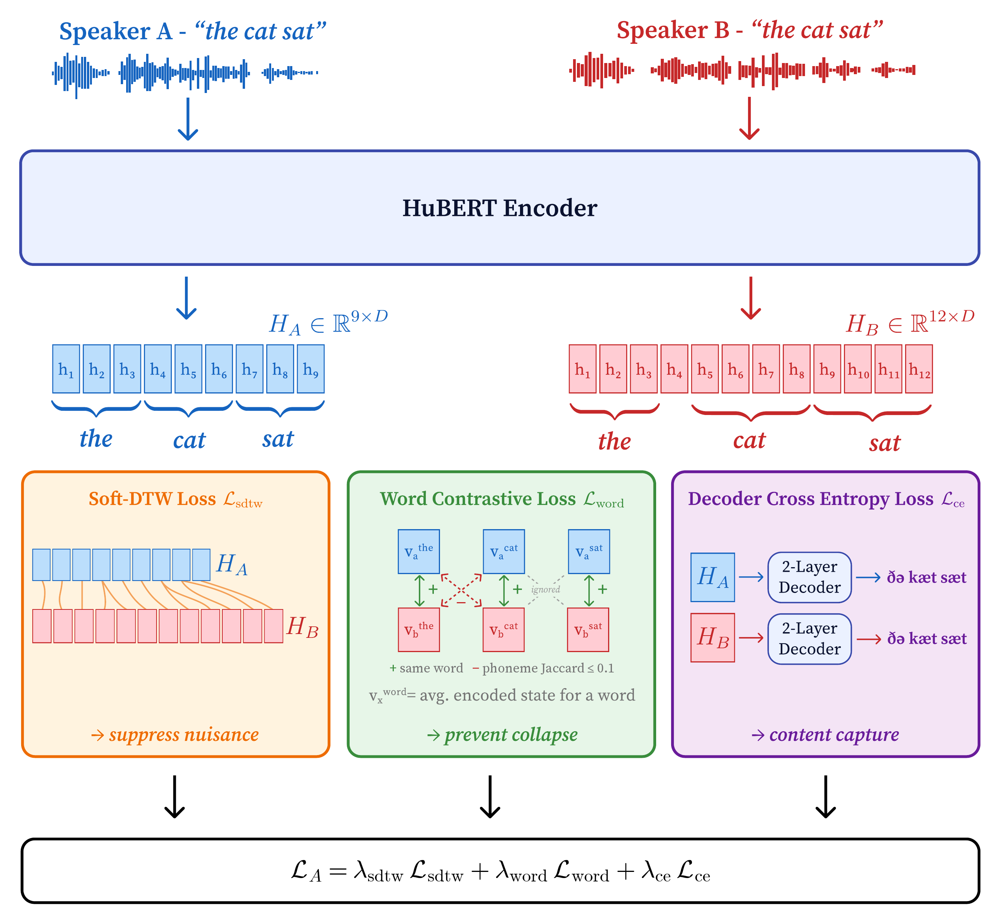
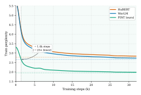
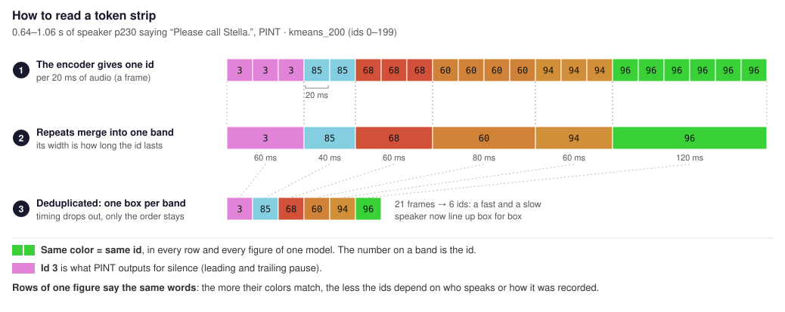
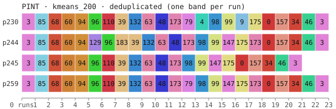
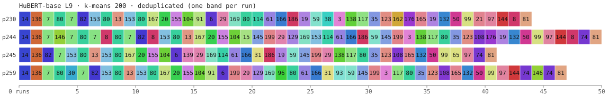
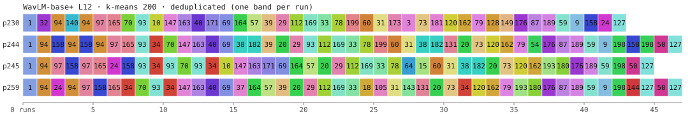
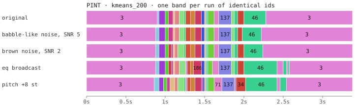
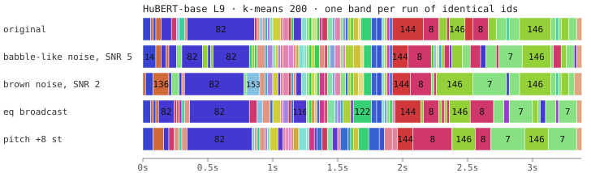
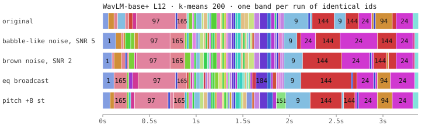

# pint-infer — PINT speech tokens from audio

**Paper:** [Content is What Remains: Invariant Speech Tokenization from Parallel
Utterances](https://arxiv.org/abs/2607.19033) (arXiv:2607.19033), accepted at
**Interspeech 2026**.

Inference code for **PINT**, a HuBERT-base speech encoder fine-tuned on parallel utterances —
the same words spoken by different speakers and under different recording conditions — so
that they map to the same frame-level representation. Audio goes in (any sample rate, any
channel count); per 20 ms frame, a 768-d vector or one token id comes out.

```python
from pint_infer import PINTTokenizer

tok = PINTTokenizer.from_pretrained("nyralabs/PINT")  # CUDA if available, else CPU
ids = tok.encode("speech.wav")  # token ids (k=200 codebook), one per 20 ms
ids = tok.encode("speech.wav", method="kmeans_500", dedup=True)  # larger codebook, repeats collapsed
frames = tok.embed("speech.wav")  # (T, 768) float32, 50 frames/s
```

Every model file is `safetensors` or JSON; nothing is unpickled. Dependencies: `torch`,
`torchaudio`, `transformers`, `huggingface_hub`, `safetensors`, `numpy`. Python ≥ 3.12.

<p align="center">
  <a href="docs/pint_method.png"></a>
</p>

**How PINT is trained.** Two recordings of the same words, here two speakers saying "the cat
sat", go through one HuBERT encoder; their frame sequences can differ in length (9 and 12
frames). Three losses compare the two sequences. Soft-DTW aligns them and pulls aligned frames
together, so what differs between the recordings, such as the speaker or the channel, is
suppressed. The word-contrastive loss pulls each word's frames towards the same word in the
other recording and pushes apart words that share almost no phonemes, so the frames cannot all
collapse to one point. A small decoder reads the phonemes back from each sequence, so the
content stays in. The released model is this encoder; its token ids come from k-means over its
frames (see [Model](#model)).

## Language modeling on PINT tokens

<p align="center">
  
</p>

Figure 1 of the [paper](https://arxiv.org/abs/2607.19033). The same 85M-parameter
decoder-only Transformer is trained on the token ids of a 6,000 h clean LibriLight subset, once
per tokenizer: HuBERT-base layer 9, WavLM layer 12 and PINT (k=200). Solid lines are training
perplexity; dashed lines are each model's final test perplexity: 1.95 for PINT against 2.78
for HuBERT and 2.67 for WavLM, 27–30 % lower. PINT drops below WavLM's final test perplexity
after about 1,400 steps, roughly 23× fewer than the full run. Lower perplexity means the next
id is easier to predict: ids that do not change with the speaker or the recording leave the
LM less to model.

## Install

```bash
pip install git+https://github.com/nyrahealth/PINT   # library + `pint-infer` CLI
```

To run the examples in this README, clone the repository and run them from its root: they read
the clips in `examples/`, which `pip install` does not ship.

```bash
git clone https://github.com/nyrahealth/PINT && cd PINT && pip install .
```

Uncompressed `.wav` files (8-, 16-, 24- or 32-bit PCM, 32- or 64-bit float) are read without
extra packages. Other formats (`.mp3`, `.flac`, `.ogg`, compressed wav) go through `torchaudio`,
which on torchaudio ≥ 2.9 needs `pip install torchcodec` and a system FFmpeg. ADPCM wav raises an
error, because torchaudio decodes only part of it; convert it to PCM first.

## Model

| Hugging Face repo | Output | `method` values |
|---|---|---|
| [`nyralabs/PINT`](https://huggingface.co/nyralabs/PINT) | continuous frames; k-means ids | `kmeans_50`, `kmeans_100`, `kmeans_200` (default), `kmeans_250`, `kmeans_500`, `kmeans_1000` |

The encoder after parallel-utterance training; its ids come from k-means codebooks over its
frames, assigned by nearest centroid. k=200 is the codebook size the paper evaluates; the other
sizes are provided for convenience.

## Reading the output

**Token ids** come one per 20 ms frame; speech is a sequence of short runs of repeated ids.
Every token figure in this README is a *token strip*; this is how to read one:



- **One row is one recording**, read left to right. A band is a run of frames with the same
  id; its width is how long the id lasts, and the number on it is the id (hover a band in the
  SVG for id and duration).
- **Color is a fixed function of the id**, so equal colors are equal tokens across rows and
  figures of the same model. Id 3 is PINT's silence token: the pink bands at both ends.
- **Rows of one figure say the same words.** A model that encodes only *what* is said, not
  *who* says it or *how* it was recorded, gives every row the same sequence of colors.
- **Deduplicated strips** (`dedup=True`) draw every run with the same width. Speaking rate
  then drops out and the rows line up box for box, so they compare the order of sounds only.

```python
from pint_infer import format_runs, token_strip_svg

ids = tok.encode("examples/01_parallel_speakers/p230.wav")
print(format_runs(ids))  # "id×run_length id×run_length ..."

svg = token_strip_svg({"p230": ids, "p244": tok.encode("examples/01_parallel_speakers/p244.wav")})
svg = token_strip_svg({...}, dedup=True)  # one band per run, lines up different speaking rates
open("tokens.svg", "w").write(svg)  # or IPython.display.SVG(svg) in a notebook
```

**Continuous frames** (`tok.embed`) are `(T, 768)` float32 arrays; every discrete method is
computed from them. `self_similarity_svg(frames)` renders the frame-to-frame cosine similarity
matrix and `embedding_heatmap_svg(frames)` the raw dimensions over time. Both are
self-contained SVGs.

**Post-processing.** `dedup=True` collapses consecutive repeats (`deduplicate_ids`); `rle=64`
returns `(tokens, run_lengths)` with runs capped at 64 (`run_length_encode`).

### Command line

```bash
pint-infer a.wav b.wav                        # kmeans_200, one line of runs per file
pint-infer a.wav --method kmeans_500 --dedup --format ids
pint-infer a.wav --rle 64                     # JSON with tokens and run lengths
pint-infer *.wav --svg strips.svg             # token strips of all inputs on a shared axis
pint-infer a.wav --model path/to/local/copy --format json
```

## Examples

[`examples/`](examples/) holds the 16 kHz clips, `tokens.json` with the ids of every codebook
and of the two baselines, and the SVGs below. Clicking a clip name below downloads its wav
(16 kHz mono), which any audio player opens.
Sources and licences: [`examples/ATTRIBUTION.md`](examples/ATTRIBUTION.md).
`python examples/make_figures.py` encodes the clips again and redraws the SVGs; when the ids
match `tokens.json`, the files come out unchanged.

For comparison, every clip also runs through two widely used encoders:
[HuBERT-base](https://huggingface.co/facebook/hubert-base-ls960) (layer 9) and
[WavLM-base+](https://huggingface.co/microsoft/wavlm-base-plus) (layer 12), each with its own
200-cluster k-means codebook fit on TIMIT. Their ids and colors are unrelated to PINT's, so
compare how well the rows of one figure agree with each other, not colors across figures. The
baseline ids in `tokens.json` are precomputed; their codebooks are not part of this repository.

### Four speakers, one sentence

Four VCTK speakers not seen in training read “Please call Stella.”
([p230](examples/01_parallel_speakers/p230.wav?raw=true), [p244](examples/01_parallel_speakers/p244.wav?raw=true),
[p245](examples/01_parallel_speakers/p245.wav?raw=true), [p259](examples/01_parallel_speakers/p259.wav?raw=true)).
Deduplicated, the strips give every run the same width, so matching colors line up across
speakers regardless of speaking rate.



**What to look for:** compare the rows. Four different voices give almost the same
sequence of ids: p230, p245 and p259 agree on the first 12 runs, and p244 differs there by one
short extra run (129) and 183 where the others have 110. Averaged over the six speaker pairs,
14 % of the runs differ (normalized edit distance).

The same four clips through the baselines: sequences about twice as long (41–50 runs instead
of 21–23), and far fewer shared stretches from one speaker to the next: 40 % (HuBERT) and
47 % (WavLM) of the runs differ between speakers.




### One utterance under distortion

VCTK p360_418 and four distorted versions: babble-like noise at 5 dB SNR, brown noise at
2 dB SNR, a broadcast EQ curve, and a pitch shift of +8 semitones
([original](examples/02_augmentations/original.wav?raw=true),
[babble-like noise](examples/02_augmentations/babble_like_noise_SNR_5.wav?raw=true),
[brown noise](examples/02_augmentations/brown_noise_SNR_2.wav?raw=true),
[eq](examples/02_augmentations/eq_broadcast.wav?raw=true),
[pitch](examples/02_augmentations/pitch_plus8_st.wav?raw=true)).



**What to look for:** all five rows are the same recording, so they share one time axis and
are not deduplicated. A band that keeps its color from the top row to the bottom row is a
stretch of speech whose ids survived the distortion. PINT gives the same id as the original
for 97 % (babble-like noise), 96 % (brown noise), 90 % (EQ) and 84 % (pitch +8 semitones) of
the frames.

The baselines on the same five clips: the distortions reshuffle many runs, and even the
trailing silence splits over different ids in each version. Only 62–71 % (HuBERT) and
57–65 % (WavLM) of the frames keep the original's id.




## Details

- **Frames.** 16 kHz input, 400-sample window, 320-sample hop: `T = ⌊(n − 400) / 320⌋ + 1`
  frames for `n` samples, i.e. 50 frames per second. Inputs shorter than one frame (25 ms)
  raise a `ValueError`. Inputs are converted to mono (channel mean) and resampled to 16 kHz
  with `torchaudio.functional.resample`.
- **Raw arrays.** `encode`/`embed` accept a NumPy array or torch tensor plus `sample_rate=`;
  a padded array needs `length=` (samples) so that padding is stripped before the
  per-utterance normalization.
- **Batching.** `encode_batch` / `embed_batch` pad to the longest item and run one forward
  pass. The encoder's convolutional front end normalizes over time, so a few ids of a padded
  utterance can differ from the same utterance encoded alone. Call `encode` per file for
  batch-independent output.
- **Device.** `from_pretrained(..., device="cpu" | "cuda" | "auto")`; `auto` picks CUDA when
  available. Attention memory grows with the square of the input length, so split long
  recordings into chunks.

## Tests

`tests/test_parity.py` checks exact token equality against reference ids on six fixture files,
for `kmeans_100` and `kmeans_200`, single and batched.
`tests/test_viz_cli.py` covers the renderers, the WAV reader, the CLI and `embed`, and checks
that the example clips reproduce every id in `tokens.json` and the six strips under
[Examples](#examples).

```bash
uv sync && uv run pytest   # PINT_MODEL overrides the Hub id
```

## Citation

[arXiv:2607.19033](https://arxiv.org/abs/2607.19033), accepted at Interspeech 2026:

```bibtex
@misc{wagner2026contentremainsinvariantspeech,
  title         = {Content is What Remains: Invariant Speech Tokenization from Parallel Utterances},
  author        = {Laurin Wagner and Bernhard Thallinger and Miroslav Stankovic and Mario Zusag},
  year          = {2026},
  eprint        = {2607.19033},
  archivePrefix = {arXiv},
  primaryClass  = {cs.CL},
  url           = {https://arxiv.org/abs/2607.19033},
  note          = {Accepted at Interspeech 2026}
}
```

## License

Code: MIT (see `LICENSE`). Model weights (on Hugging Face): CC BY-NC 4.0, derived from
[facebook/hubert-base-ls960](https://huggingface.co/facebook/hubert-base-ls960) (Apache
License 2.0); each model repository carries a `NOTICE`. Example and test audio keeps the
licence of its source corpus (CC BY 4.0), see
[`examples/ATTRIBUTION.md`](examples/ATTRIBUTION.md).
